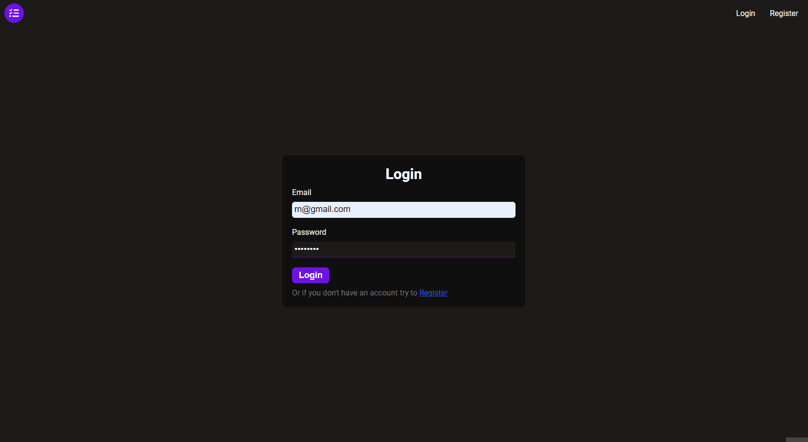

# Task Manager App
A responsive web application built with React, Redux for
efficient state management, and Firebase for the realtime
database and authentication backend, which allows users
to conveniently create, view, edit, delete, organize, filter,
and track tasks for improved productivity and workflow
management.

## Features
- Task Management:
    - Users can create, view, edit, and delete tasks.
    - The app allows organizing tasks into different categories such as (ongoing,unfinished,finished) task for better organization.
- Efficient State Management:
    - The application is built using React and Redux, which enables efficient state management, ensuring a smooth and responsive user interface.
    - utilizes Redux's createAsync function to handle asynchronous actions, such as fetching data from Firebase for authentication and firesotre, ensuring a streamlined workflow.
- Authentication:
    - Firebase is used as the real-time database and authentication backend.
    - Users can sign up and log in using Firebase authentication, providing a secure and reliable login system.

## Overview


## Demo
> This gif shows a brief overview of the project, and it may take a while to load!


## 🚀 Getting Started
### To run this project on your system:
- Ensure Node.js is installed on your system.
- Clone project.
- Set up Firebase:
    - Create a Firebase project at https://firebase.google.com and obtain the project credentials.
- Navigate to the project directory.
- Create an .env file and add the project credentials from firbase to the following variables:
```
REACT_APP_apiKey=
REACT_APP_authDomain=
REACT_APP_projectId=
REACT_APP_storageBucket=
REACT_APP_messagingSenderId=
REACT_APP_appId=
REACT_APP_measurementId=
```
- Run npm install to install the necessary dependencies.
- Execute 'npm start' to start.
